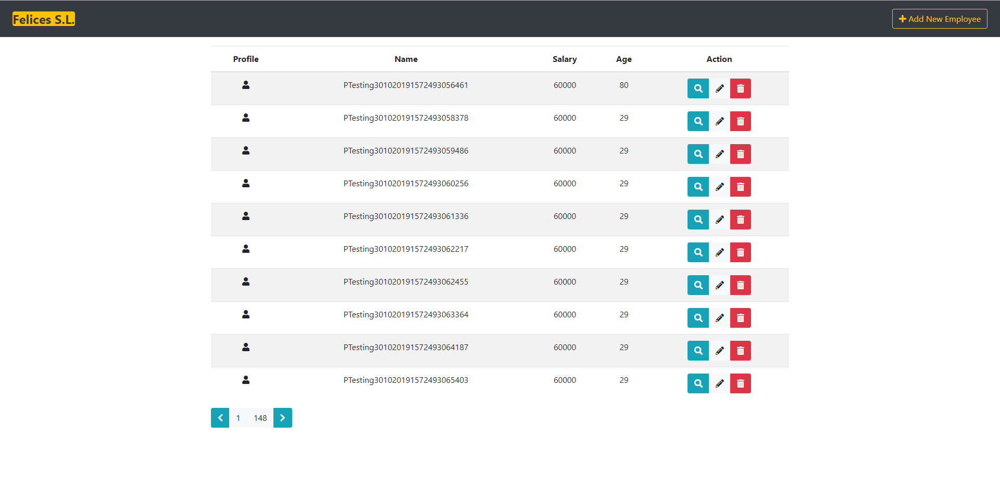

#   Employees

Este proyecto es un ejercicio de un alumno de bootcamp de full stack,  contiene una aplicación básica de gestión de personal.

  

## Como funciona

 

Al abrir la aplicación recibiremos, a través de una petición GET, un listado con todos los datos de trabajadores proporcionados por [http://dummy.restapiexample.com/](http://dummy.restapiexample.com/)
